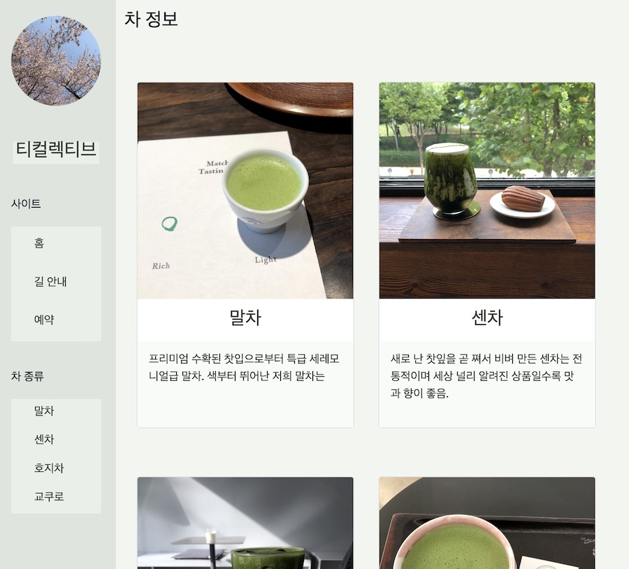
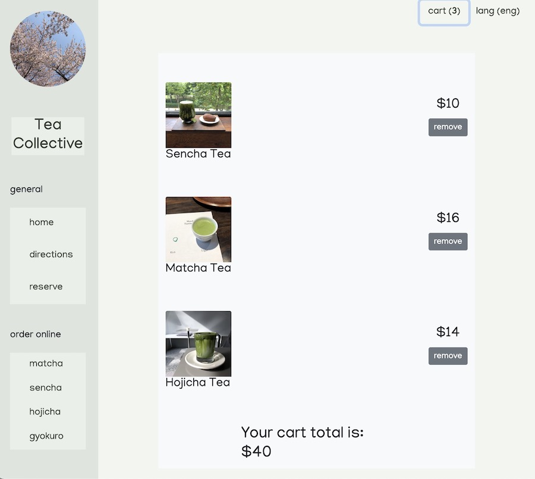
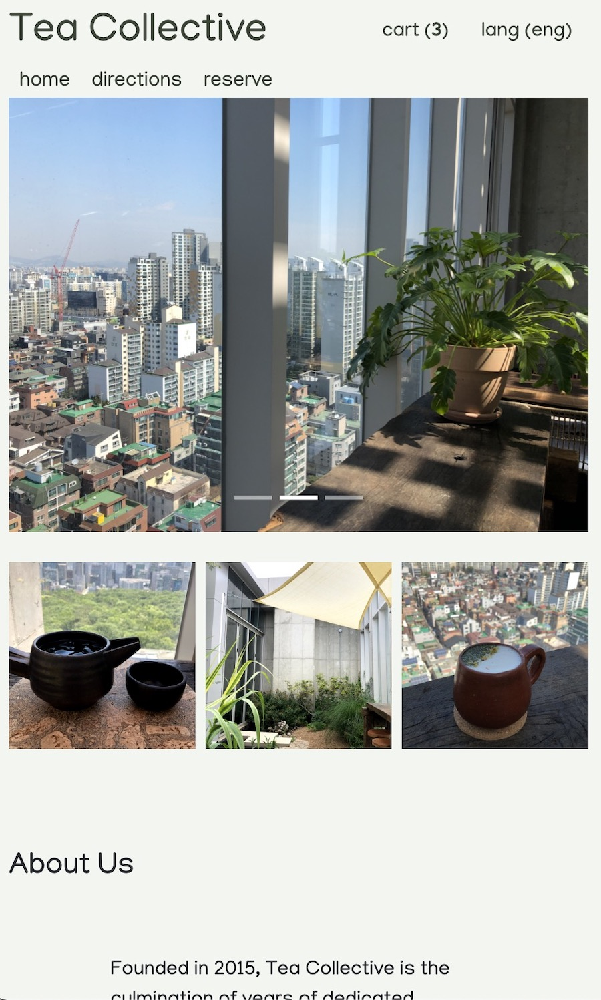

# React Teashop

React Teashop is a homepage for Tea Collective. This website has two language options that can be toggled between: English and Korean. As well as providing information the shop and its products, it also features a shopping cart where users can add the shop's tea, and a reservation page.

# React Teashop

HTML5, CSS3, React, Bootstrap, reactstrap, react-router-dom
